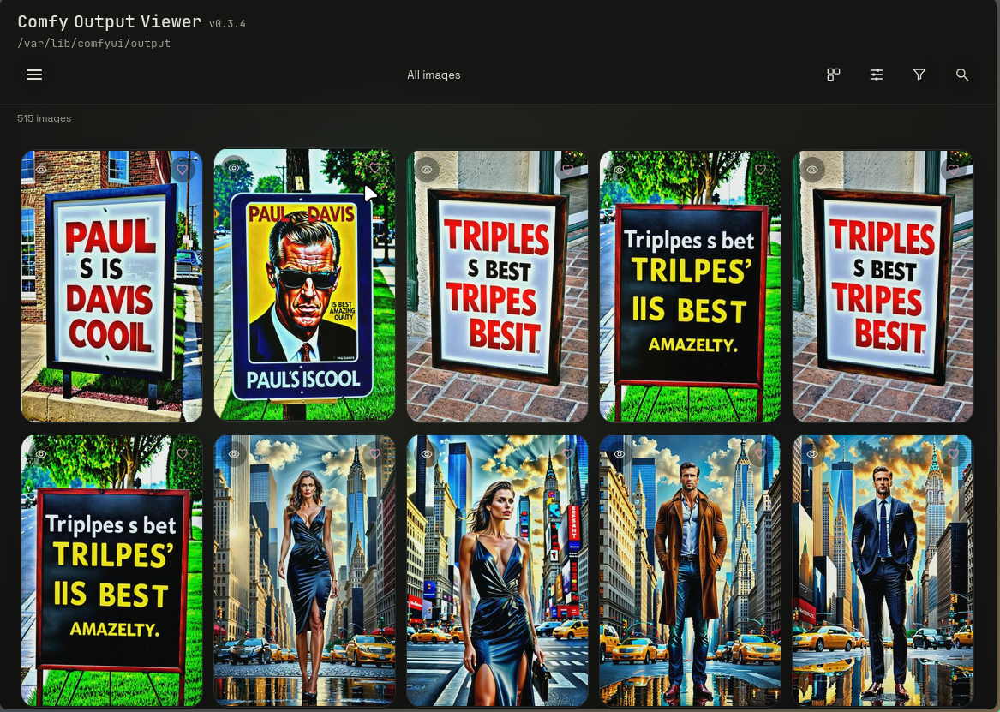
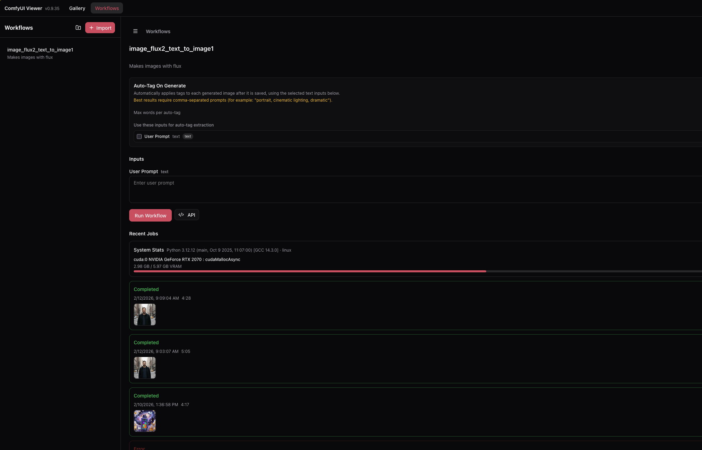

# Comfy Output Viewer

A powerful, self-hosted gallery and workflow management tool for ComfyUI. Organize your AI-generated images with ratings, tags, and favorites. Run workflows directly from the browser with full parameter control.

Built with React + TypeScript frontend and Node.js/Express backend with SQLite storage.





## Features

### Gallery

- **Image Management** — Syncs images from your ComfyUI output folder into a separate data directory for independent organization. Source folder remains read-only.
- **Ratings & Favorites** — Rate images on a 5-star scale and mark favorites for quick filtering.
- **Tagging System** — Create custom tags for flexible organization. Filter by tags or view untagged images.
- **Hide & Delete** — Hide images to filter them out by default (reversible), or delete them entirely. Deleted images are blacklisted to prevent re-import on future syncs.
- **Sorting & Filtering** — Sort by date created, modified, name, size, or rating. Filter by favorites, ratings, tags, or hidden status.
- **Grid Customization** — Adjustable column count (1-12 or auto) with cover or contain fit modes.
- **Detail View** — Full-resolution image viewer with zoom/pan support. Swipe navigation on mobile, keyboard navigation on desktop.
- **Download** — Download images directly to your device.
- **Multi-Select** — Bulk operations for favorites, ratings, tags, hide, and delete.

### Slideshow

- **Filtered Slideshows** — Turn any gallery view into a slideshow, respecting current filters and sort order.
- **Playback Modes** — Fixed interval, random interval range, or manual navigation.
- **Shuffle** — Play in order or randomized.
- **Progress Indicator** — Optional progress bar showing time until next slide.
- **Pause Control** — Click or tap anywhere to pause/resume.
- **Smooth Transitions** — Fade transitions with intelligent preloading.

### Workflow Import & Execution

- **Direct Execution** — Run ComfyUI workflows directly from the browser.
- **Easy Import** — Export workflows as API format from ComfyUI and import the JSON.
- **Parameter Overrides** — Select any node value to expose as an editable field in the UI. Add custom labels without affecting the workflow sent to ComfyUI.
- **Job Monitoring** — Track generation progress in real-time via WebSocket connection.
- **Auto-Import Results** — Generated images are automatically synced and linked to their workflow inputs.
- **Prompt Viewing** — View the exact prompt and settings that created any image generated in-app.
- **Workflow Prefill** — Load a workflow with values pre-filled from a previously generated image.
- **Multiple Workflows** — Import and manage as many workflows as you need.

### Theming

- **Light, Dark, and System** — Three theme modes with automatic system preference detection.
- **Modern Design** — Glassmorphism panels, orange/violet accent palette, Inter font, and smooth micro-interactions throughout.

---

## Requirements

- Node.js 20+
- npm (or another Node package manager)
- ComfyUI instance (for workflow execution features)

---

## Quick Start

1. Install dependencies:
   ```bash
   npm install
   ```

2. (Optional) Create a `.env` file based on `.env.example`.

3. Run the development servers:
   ```bash
   npm run dev
   ```
   - Frontend: http://localhost:8008
   - API server: http://localhost:8009

4. Click **Sync** to import images from your ComfyUI output folder.

---

## Configuration

Configure via environment variables or a `.env` file:

| Variable | Default | Description |
|----------|---------|-------------|
| `COMFY_OUTPUT_DIR` | `/var/lib/comfyui/output` | Source folder to sync images from (read-only) |
| `DATA_DIR` | `~/comfy_viewer/data` | Working directory for images, thumbnails, and database |
| `SERVER_PORT` | `8009` (dev) / `8008` (prod) | HTTP server port |
| `COMFY_API_URL` | `http://127.0.0.1:8188` | ComfyUI API endpoint for workflow execution |
| `SYNC_INTERVAL_MS` | `0` (disabled) | Auto-sync interval in milliseconds |
| `THUMB_MAX` | `512` | Maximum thumbnail dimension in pixels |
| `THUMB_QUALITY` | `72` | JPEG quality for thumbnails (0-100) |

---

## Production

Build and run for production:

```bash
npm run build
npm run start
```

Serves the API and static UI on http://localhost:8008.

---

## Nix / NixOS

This repo includes a Nix flake with a package and NixOS module.

### Build or Run Locally

```bash
nix build .#
./result/bin/comfy-output-viewer
```

```bash
nix run .#
```

### NixOS Module

Example `configuration.nix` using the overlay and module:

```nix
{
  nixpkgs.overlays = [ inputs.comfy-output-viewer.overlays.default ];
  imports = [ inputs.comfy-output-viewer.nixosModules.default ];

  services.comfy-output-viewer = {
    enable = true;
    openFirewall = true;
    outputDir = "/var/lib/comfyui/output";
    dataDir = "/var/lib/comfy-output-viewer";
    port = 8008;
    # syncIntervalMs = 60000;
    # thumbMax = 512;
    # thumbQuality = 72;
  };
}
```

### Module Options

| Option | Description |
|--------|-------------|
| `enable` | Start the server on boot |
| `openFirewall` | Open the configured port in the firewall |
| `outputDir` | Source directory for ComfyUI outputs |
| `dataDir` | Writable data directory for images, thumbnails, and database |
| `port` | HTTP port (default 8008) |
| `syncIntervalMs` | Auto-sync interval in ms (`null` disables) |
| `thumbMax` | Maximum thumbnail dimension |
| `thumbQuality` | Thumbnail JPEG quality |
| `user`, `group`, `createUser` | Control the system user/group for the service |
| `extraEnvironment` | Extra environment variables for the service |

---

## How It Works

1. **Sync** copies images from your ComfyUI output folder into the app's data directory. The source folder is never modified.
2. **Thumbnails** are generated on sync for fast gallery browsing.
3. **Metadata** (ratings, tags, favorites, hidden status) is stored in a local SQLite database.
4. **Blacklist** prevents deleted images from being re-imported on subsequent syncs.
5. **Workflows** are stored with their API JSON and configurable input definitions.
6. **Jobs** connect to ComfyUI via WebSocket for real-time progress updates.

---

## Tech Stack

- **Frontend**: React 18, TypeScript, Vite, React Router
- **Backend**: Node.js, Express, WebSocket
- **Database**: SQLite
- **Image Processing**: Sharp
- **Theming**: CSS custom properties with light/dark/system modes

---

## Development

```bash
npm run dev      # Start dev servers (Vite + Express)
npm run build    # Build production bundle
npm run preview  # Preview production build
npm run start    # Run production server
```

## Testing

```bash
npm run test            # Full suite (server + client)
npm run test:all        # Alias for full suite
npm run test:server     # Server tests only (Node environment)
npm run test:client     # Client tests only (jsdom environment)
npm run test:coverage   # Coverage for both suites
```

Watch mode:

```bash
npm run test:server:watch
npm run test:client:watch
```

Test setup highlights:
- Server tests: route integration and service/state unit coverage under `src/server/**/*.test.{js,ts}`.
- Client tests: component/hook/util coverage under `src/client/**/*.test.{ts,tsx}` with Testing Library and jsdom.

---

## License

MIT
