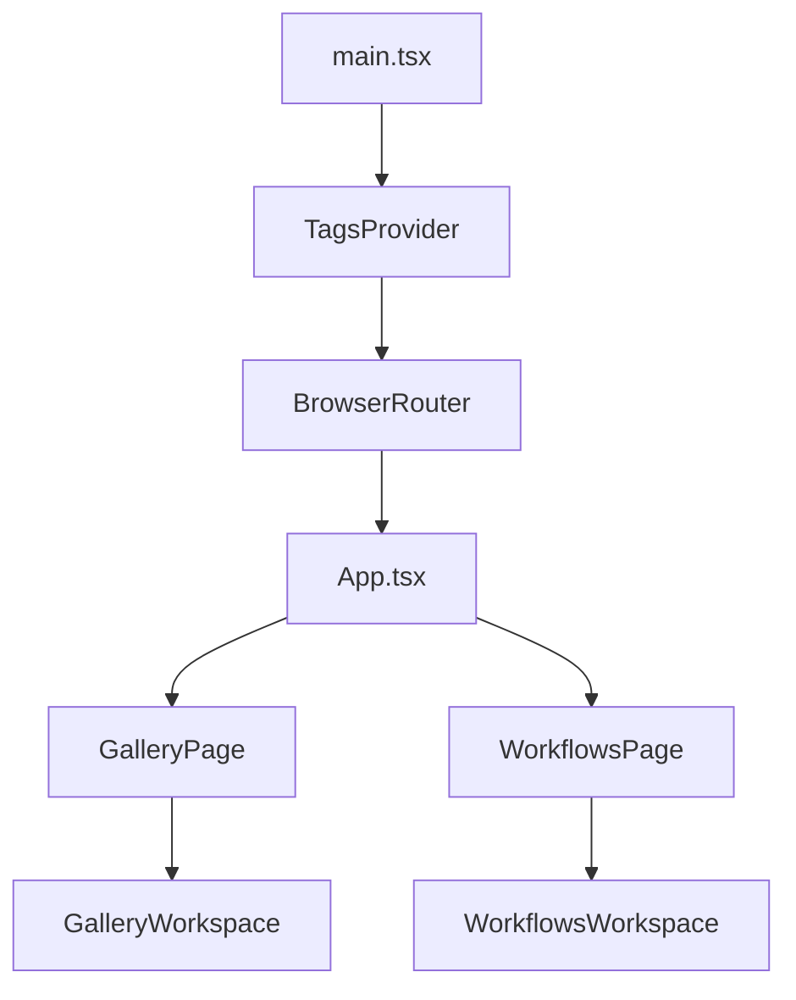

# Frontend Architecture Audit

Date: 2026-02-11  
Scope: `src/client` component organization, page layering, and reuse.

Follow-up implementation plan: `docs/frontend-refactor-plan.md`.

## 1) Frontend Layering (Current)

```text
main.tsx
└─ Providers + Router
   ├─ TagsProvider (global tag state)
   └─ Route shell: App.tsx
      ├─ Global top nav + theme/accent controls
      └─ Outlet pages
         ├─ GalleryPage -> GalleryWorkspace
         └─ WorkflowsPage -> WorkflowsWorkspace
```

Observed layers:
- App shell: `src/client/App.tsx`
- Route pages: `src/client/pages/*`
- Workspace/orchestration: `src/client/components/gallery/GalleryWorkspace.tsx`, `src/client/components/workflows/WorkflowsWorkspace.tsx`
- Domain UI (gallery/workflows): `src/client/components/*`, `src/client/components/workflows/*`
- Shared primitives: `src/client/components/ui/*`
- Cross-cutting state/hooks/apis/utils: `src/client/contexts`, `src/client/hooks`, `src/client/lib`, `src/client/utils`

## 2) Relationship Trees

### 2.1 App Shell -> Pages



### 2.2 Gallery Page Tree

```text
GalleryPage
└─ GalleryWorkspace
   ├─ TopBar
   │  ├─ ui/button
   │  ├─ ui/badge
   │  └─ RatingStars
   ├─ TagDrawer
   │  ├─ ui/button
   │  └─ ui/badge
   ├─ Gallery
   │  └─ ImageCard
   ├─ ImageModal
   │  ├─ ui/button
   │  └─ RatingStars
   ├─ AutoTagModal
   │  ├─ ui/button
   │  └─ ui/badge
   ├─ SlideshowSettingsModal
   │  └─ ui/button
   └─ SlideshowView
```

### 2.3 Workflows Page Tree

```text
WorkflowsPage
└─ WorkflowsWorkspace
   ├─ ui/button
   ├─ WorkflowEditorPanel
   │  └─ ui/button
   └─ WorkflowDetail
      ├─ useWorkflowDetailController (hook)
      ├─ WorkflowHeader
      │  └─ ui/button
      ├─ AutoTagSettingsPanel
      ├─ WorkflowInputsSection
      │  ├─ ui/button
      │  └─ ImageInputField
      │     ├─ ui/button
      │     └─ ImagePickerModal
      │        └─ ui/button
      ├─ WorkflowJobsSection
      │  ├─ JobCard
      │  │  └─ ui/button
      │  └─ SystemStatsPanel
      ├─ WorkflowOutputModalController
      │  └─ ImageModal
      │     ├─ ui/button
      │     └─ RatingStars
      ├─ ExportApiModal
      │  ├─ ui/button
      │  └─ ui/dialog
      └─ WorkflowEditorPanel
         └─ ui/button
```

### 2.4 Shared Between Both Pages

Directly shared across both route trees:
- `src/client/components/ImageModal.tsx`
- `src/client/components/RatingStars.tsx`
- `src/client/components/ui/button.tsx`

## 3) Labeled Page Visuals (Component Sections)

### 3.1 Gallery Page (Section Sketch)

```text
+----------------------------------------------------------------------------------+
| App nav (App.tsx): Title/version, Gallery/Workflows tabs, Theme/Accent popover  |
+----------------------------------------------------------------------------------+
| TopBar                                                                            |
| - drawer button - filter badge - slideshow/multi-select/view/filter/search tools |
| - multi-select actions row (conditional)                                          |
| - tool popover row (view/filters/search)                                          |
+----------------------------------------------------------------------------------+
| TagDrawer (overlay from left, conditional)                                        |
+----------------------------------------------------------------------------------+
| Gallery                                                                            |
| - ImageCard[] tiled grid (virtualized progressive batch)                          |
+----------------------------------------------------------------------------------+
| Overlays/modals (conditional): ImageModal, AutoTagModal, SlideshowSettingsModal, |
| SlideshowView                                                                      |
+----------------------------------------------------------------------------------+
```

### 3.2 Workflows Page (Section Sketch)

```text
+----------------------------------------------------------------------------------+
| App nav (App.tsx): Title/version, Gallery/Workflows tabs, Theme/Accent popover  |
+----------------------------------------------------------------------------------+
| WorkflowsWorkspace                                                                |
| +-------------------------------+ +--------------------------------------------+ |
| | Sidebar (workflow list/folder)| | Main content                               | |
| | - import button               | | - header row + sidebar toggle              | |
| | - organize mode controls      | | - WorkflowEditorPanel (import mode) OR     | |
| | - folder/workflow tree        | |   empty state OR WorkflowDetail            | |
| +-------------------------------+ |   - run inputs                             | |
|                                   |   - auto-tag-on-generate controls          | |
|                                   |   - recent jobs (JobCard[]) + stats panel  | |
|                                   |   - ExportApiModal                         | |
|                                   |   - ImageModal for outputs/inputs          | |
|                                   +--------------------------------------------+ |
+----------------------------------------------------------------------------------+
```

## 4) Component Inventory (All Frontend Components)

Legend:
- `G` = used in Gallery page tree
- `W` = used in Workflows page tree
- `Shared` = appears in both trees

| Component | Layer | Usage |
|---|---|---|
| `src/client/components/gallery/GalleryWorkspace.tsx` | workspace | G |
| `src/client/components/workflows/WorkflowsWorkspace.tsx` | workspace | W |
| `src/client/components/workflows/WorkflowDetail.tsx` | workflows domain | W |
| `src/client/components/workflows/workflow-detail/WorkflowHeader.tsx` | workflows domain | W |
| `src/client/components/workflows/workflow-detail/AutoTagSettingsPanel.tsx` | workflows domain | W |
| `src/client/components/workflows/workflow-detail/WorkflowInputsSection.tsx` | workflows domain | W |
| `src/client/components/workflows/workflow-detail/WorkflowJobsSection.tsx` | workflows domain | W |
| `src/client/components/workflows/workflow-detail/WorkflowOutputModalController.tsx` | workflows domain | W |
| `src/client/components/workflows/WorkflowEditorPanel.tsx` | workflows domain | W |
| `src/client/components/workflows/ImageInputField.tsx` | workflows domain | W |
| `src/client/components/workflows/ImagePickerModal.tsx` | workflows domain | W |
| `src/client/components/workflows/JobCard.tsx` | workflows domain | W |
| `src/client/components/workflows/SystemStatsPanel.tsx` | workflows domain | W |
| `src/client/components/workflows/ExportApiModal.tsx` | workflows domain | W |
| `src/client/components/TopBar.tsx` | gallery domain | G |
| `src/client/components/TagDrawer.tsx` | gallery domain | G |
| `src/client/components/Gallery.tsx` | gallery domain | G |
| `src/client/components/ImageCard.tsx` | gallery domain | G |
| `src/client/components/AutoTagModal.tsx` | gallery domain | G |
| `src/client/components/SlideshowSettingsModal.tsx` | gallery domain | G |
| `src/client/components/SlideshowView.tsx` | gallery domain | G |
| `src/client/components/ImageModal.tsx` | shared domain | Shared |
| `src/client/components/RatingStars.tsx` | shared domain | Shared |
| `src/client/components/ui/button.tsx` | shared UI primitive | Shared |
| `src/client/components/ui/badge.tsx` | shared UI primitive | G |
| `src/client/components/ui/popover.tsx` | shared UI primitive | App shell |
| `src/client/components/ui/dialog.tsx` | shared UI primitive | W |

Related non-component support modules under component folders:
- `src/client/components/workflows/formatters.ts`
- `src/client/components/workflows/types.ts`
- `src/client/components/workflows/workflow-detail/useWorkflowDetailController.ts`
- `src/client/components/workflows/workflow-detail/useWorkflowAutoTagSettings.ts`

## 5) Common Components

Most reused components in active frontend routes:
- `src/client/components/ui/button.tsx` (widest reuse across app shell, gallery, workflows)
- `src/client/components/ImageModal.tsx` (shared image detail experience in gallery and workflows)
- `src/client/components/RatingStars.tsx` (shared rating control in top bar and modals)

Context-level common dependency:
- `src/client/contexts/TagsContext.tsx` (global tag counts + suggestions used by both gallery/workflow flows)

## 6) Organization Assessment

### What is working well
- Clear route entry points and page wrappers: `GalleryPage` and `WorkflowsPage` stay thin.
- Good separation of concerns at a high level: app shell vs gallery/workflows workspaces.
- Strong shared primitives and utility modules (`hooks`, `lib`, `utils`) reduce repeated low-level logic.
- `ImageModal` and `RatingStars` are effectively reused cross-page.

### Main organization risks
- Very large orchestration/controller files (high cognitive load):
  - `src/client/components/workflows/workflow-detail/useWorkflowDetailController.ts` (~935 lines)
  - `src/client/components/ImageModal.tsx` (~898 lines)
  - `src/client/components/workflows/WorkflowsWorkspace.tsx` (~700 lines)
  - `src/client/components/TopBar.tsx` (~615 lines)
- `WorkflowDetail` is now a thin shell, and auto-tag logic has been extracted, but its controller hook still mixes several concerns (run pipeline, jobs stream/polling, output modal state, metadata mutations).
- Domain logic and network effects are still concentrated in a few large files (especially workspace components, `ImageModal`, and the workflow controller hook).

### Suggested refactor targets (highest impact first)
1. Continue splitting `useWorkflowDetailController` into focused hooks/modules (`useWorkflowJobStream`, `useWorkflowOutputModalState`, `useWorkflowRunPipeline`) after extracting `useWorkflowAutoTagSettings`.
2. Split `GalleryWorkspace` follow-up composition surfaces (`GalleryFiltersController`, `GalleryActionsController`, `GalleryModalController`) now that controller extraction exists.
3. Split `ImageModal` internals: `ImageModalChrome`, `ImageModalPromptPanel`, `useImageModalGestures`, `useImagePromptData`.
4. Reduce `TopBar` by extracting tool panels: `ViewToolPanel`, `FilterToolPanel`, `BulkActionsBar`.
5. Maintain strict reachability checks for `ui/*` primitives to keep shared surface minimal.

## 7) Questions For Next Pass

1. Do you want the next pass to include a concrete refactor plan with proposed file splits and exact prop contracts for the top 2 files (`WorkflowDetail`, `GalleryWorkspace`)?
2. Should I treat unused `ui/*` primitives as deprecation candidates and open a cleanup PR plan, or keep them as intentional scaffolding?
3. Do you want this doc expanded with hook/util dependency trees (not just component trees) to map data flow end-to-end?
